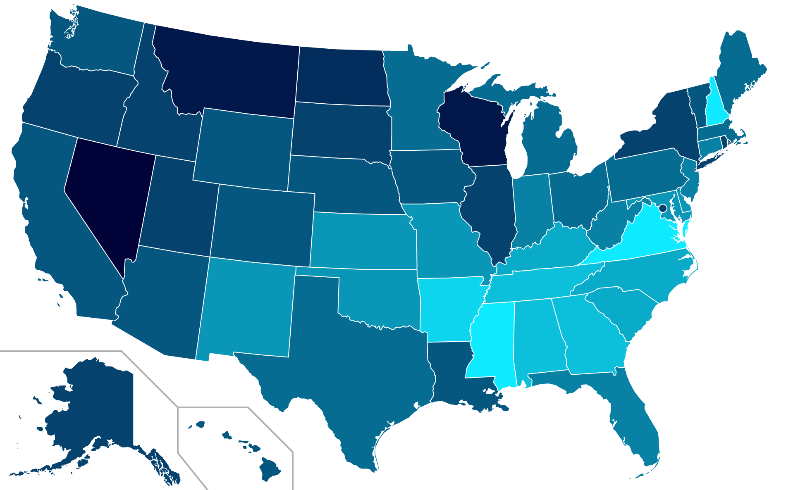

# Computing the Church-to-Bar Ratio for Each U.S. State

The brighter the color, the higher the church-to-bar ratio.

## Method

From the latest (2023) [County Business Patterns](https://www.census.gov/programs-surveys/cbp.html) data published by the U.S. Census Bureau, I extracted the number of establishments in each state that have NAICS codes 813110 (places of worship including churches, temples, mosques, synagogues, etc.) and 722410 (bars, taverns, drink-serving nightclubs, etc.). For each state, I then divided the number of NAICS 813110 establishments by the number of NAICS 722410 establishments to get the "church to bar ratio". Finally, I partitioned the resulting ratio distribution into twelve color groups, and plotted each state’s ratio color on the map. Used log-transformed values when creating the partitions. Source code implementing these calculations is contained in the Jupyter notebook to facilitate peer review.

## Results

The "Bible Belt" shows up in brighter colors, as we'd expect.

## Possible bias in the result

If NAICS code 813110 excludes church facilities with unpaid staff and clergy—i.e., if the Census Bureau does not to consider them "places of industry" since no one is getting paid to work there—the LDS presence in the west will be severely underrepresented. This warrants further review of NAICS measurement methodology before producing future map updates. Reader comments on the appropriateness of NAICS industry codes for this study are very welcome!
